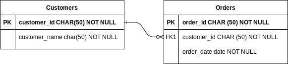

---
hide:
  - footer
---


```text

8 888888888o.           ,o888888o.      8 888888888o.    8 888888888888
8 8888    `^888.     . 8888     `88.    8 8888    `88.   8 8888
8 8888        `88.  ,8 8888       `8b   8 8888     `88   8 8888
8 8888         `88  88 8888        `8b  8 8888     ,88   8 8888
8 8888          88  88 8888         88  8 8888.   ,88'   8 888888888888
8 8888          88  88 8888         88  8 888888888P'    8 8888
8 8888         ,88  88 8888        ,8P  8 8888`8b        8 8888
8 8888        ,88'  `8 8888       ,8P   8 8888 `8b.      8 8888
8 8888    ,o88P'     ` 8888     ,88'    8 8888   `8b.    8 8888
8 888888888P'           `8888888P'      8 8888     `88.  8 888888888888


                       SYNTHETIC DATA GENERATOR                            
```

<br>

# Getting Started

**Dore** is a tool that can generate fake data for you for schemas with complex dependencies; such as schemas with 
hierarchical relations, PK/FK relations, nested values, and so on. All you need to do is provide a single input 
which is a specification of the target data requirements and Dore generates the required databases, tables, and data 
for those tables for you. 

This input is known as the [**Manifest**](manifest/manifest/). Once the manifest is created, it can be shared with 
others in order to help them generate the same data as well!

Dore leverages fake data generation libraries (ex: Faker), which allow you to generate fake values for certain data 
types, and generates fake data for entire schemas.

## Installation

Install the `dore` package with [pip](https://pypi.org/project/dore/).

```console
$ pip install dore
```

## Usage

```shell
$ dore --manifest MANIFEST_FILE [OPTIONS]
```

## Next Steps

Once the installation is complete, and if this is the first time you're trying out Dore, we recommend you check out our
[**Tutorial**](/tutorial/overview/) which walks you through using Dore to generate fake data for the ecommerce schema 
shown below:

<figure markdown>
  
  <figcaption>Ecommerce schema</figcaption>
</figure>


## Documentation

* [CLI Reference](./cli/cli_reference.md): to view details on usage of `dore` command.

* [Manifest Reference](./manifest/manifest.md): to view documentation on Dore Manifest.
