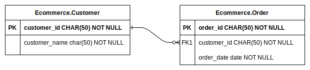

# Ref

**Manifest path: `$.models[*].attributes[*].value`**

Dore allows you to define values of an attribute as being dependent on values on other attributes.

Often times, we would want the value of an attribute to be based on the value of an attribute of a different model.
A typical scenario where we might want do this is while generating data in a relational database with Foreign Key 
dependencies.

Before Dore starts generating records for any model, it analyzes the attribute and model
dependencies and creates an iteration order over the models based on topological sorting of their
dependencies. By doing this, Dore ensures that records for a model which has other models
dependent on it are generated before generating records for the dependent models.


## Example

You can consider the [E-Commerce example](../../example.md) to understand this better.



In order to generate data for this schema with Dore, we can specify the value config for `customer_id` in the 
`Ecommerce.Order` model as a `ref` value and provide a reference to the dependent attribute and model, which is the 
`customer_id` attribute of the `Ecommerce.Customer` model like so:

```json title="Value config for the Ecommerce.Order attribute" linenums="1"
{
  "value": {
    "ref": "Customer.customer_id"
  }
}
```


## Fields

* ### `ref` (string) [required]

    ** Manifest path: `$.models[*].attributes[*].value.ref` **

    A string of the form: `modelId.attributeId` which specifies the model and attribute ID on which the current 
    attribute's value is dependent / derived from.
  