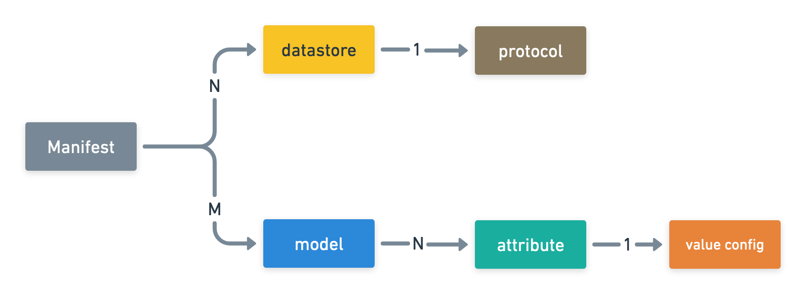

# Dore Manifest

## Overview

To generate data for any schema with Dore, we need to create a **Dore Manifest**, which is a JSON config that contains 
specification of the target data.

Here's a little mind map that tries to visually represent the manifest schema. It might be helpful to refer 
to this mind map while reading over the following sections.

<figure markdown>
  
  <figcaption>Fig 1: Manifest mind map</figcaption>
</figure>

A manifest can have multiple **datastores** (think of them as databases) and **models** (think of them as tables) defined.
Each model in turn has a set of **attributes** (think of them as columns) associated with it. These three entities form
the crux of the manifest.

The **protocol** of a datastore determines the type of system the datastore represents. For example, `"mysql"`, `"mongodb"`
, etc. are all protocols.

The **value config** on an attribute is used to configure how Dore should generate values for the attribute.

The three entities - datastores, models, and attributes - might have a set of **protocol specific properties** defined 
which tells Dore how these entities are or should be represented/persisted in the underlying system.

## Fields

* ### `datastores`
  
    **Manifest path: `$.datastores`**
    
    You can think of a datastore as a *database in MySQL*.
    
    A single Dore manifest can have multiple datastores definitions.
    
    Please refer [Datastores](./datastores/datastores.md) for further details.

* ### `models`
  
    **Manifest path: `$.models`**

    You can think of a model as *table* in MySQL.
    
    A single dore manifest can have multiple models definitions.
    
    Please refer [Models](./models/models.md) for further details.

* ### `attributes`
  
    **Manifest path: `$.models[*].attributes`**
    
    Each model typically has a set of attributes associated with it. 
    
    You can think of an attribute as a *column* of a MySQL table.
    
    Please refer [Attributes](./attributes/attributes.md) for further details.

