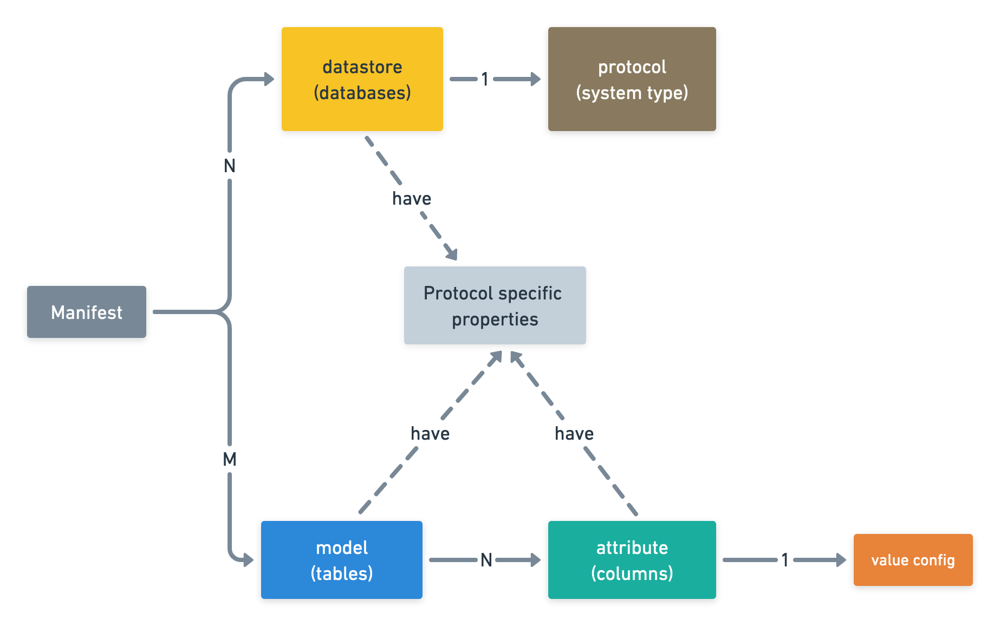

# Dore Manifest

## Introduction

To generate data for any schema with Dore, we need to create a **Dore Manifest**, which is a JSON config that contains 
specification of the target data.

The following sections contain documentation about the structures and components that form the Dore manifest.

Before reading the schema and fields mentioned in the following sections, it might be helpful to remember 
what Dore's core functionality is as this will help in understanding what details we need to provide in the config
in order to ask Dore to do something. It also helps us understand the various components and fields in the manifest 
come together in the big picture.
    
    
Fundamentally, Dore is a config based fake data generation tool. 
    
    
It supports data generation for various protocols (MySQL, MongoDB, Elasticsearch, etc) 
with the ability to generate data which adheres to the referential integrity constraints and inter
schema dependencies.
The referential integrity is maintained irrespective of which protocol either of the models reside
in are using.
    
## How it Works

A typical user's journey with Dore looks something like this: 
We start by creating the manifest which contains details about the config based on which
data is to be generated. The manifest contains details for `models` (which are analogous to
tables in SQL), their `attributes` (which are analogous to columns of a SQL table), and
`datastores` (which are analogous to databases in SQL).
    
    
Once the manifest is created, we invoke Dore with it.

Dore reads the manifest and proceeds to generate data for models by analyzing
the model's attributes and their dependencies. It generates values for each attribute of a model 
and the collection of values for a model's attributes forms a record for the model which might then 
persisted in the a datastore. This is done until Dore has generated the required number of records
for each of the models.

## Schema Overview

In order to do the above, Dore needs some details in the manifest.

The list here is intentionally not exhaustive as we want to take a look at the forest from the sky before we actually 
go into it in order to avoid getting lost. The exhaustive schema documentation can be referred to in the 
later sections.

Here's a little mind map that tries to visually represent the information provided below. It might be helpful to refer 
to this mind map while reading over the following sections.

<figure markdown>
  
  <figcaption>Fig 1: Manifest mind map</figcaption>
</figure>

### Datastores
**Manifest path: `$.datastores`**

You can think of a datastore as a *database in MySQL*, a *database in MongoDB*, an *Elasticsearch cluster*, and so on.

A single Dore manifest can have multiple datastores defined within it.

Please refer [Datastore](./datastores/datastores.md) for details on the datastores.

#### Protocol
**Manifest path: `$.datastores.protocol`**

Though datastores are an abstraction, each datastore typically represents an actual physical entity (for ex: a database
system) which can be implemented in different *ways*. We call these *ways* **protocols**. For example, `"mysql"` is a 
protocol and so is `"elasticsearch"`. Dore needs to know the protocol a particular datastore uses in 
order to interact with the actual physical system.

### Models
**Manifest path: `$.models`**

You can think of a model as *table* in MySQL, an *index* in Elasticsearch, a *collection* in MongoDB, and so on.

A single dore manifest can have multiple models defined within it.

Please refer [Models](./models/models.md) for details on models.

### Attributes
**Manifest path: `$.models[*].attributes`**

Each model typically has a set of attributes associated with it. 

You can think of an attribute as a *column* of a MySQL 
table (where the model corresponds to the table), a *field* of an Elasticsearch index (where the model corresponds to
the index), a *field* of a MongoDB collection (where the model corresponds to the MongoDB collection), and so on.

Please refer [Attributes](./attributes/attributes.md) for details on attributes.

#### Attribute Value
**Manifest path: `$.models[*].attributes[*].value`**

As mentioned before, Dore generates fake data for models by generating values for each attribute and 
combining them to form a record repeatedly. This is done until Dore has generated the required number of records
for each model.

Thus, in our manifest, we need to specify how Dore should generate *value* for an attribute.

Please refer [Attribute Value Generators](./attributes/value_generators.md) for details.
