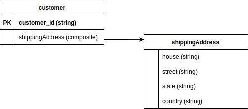

# Model Persistence

** Manifest path: `$.models[*].persistence`**

The `persistence` of a model determines how a particular model is persisted by Dore.

## Overview

This is particularly useful when you have nested attributes that need to be represented as a separate model in itself 
but do not need to be persisted -- you would want to only generate records for that model to be reused elsewhere.

Consider the case of a `customer` model which has a `shippingAddress` attribute. We would want to generate addresses 
for the customer and use them as values for the `shippingAddress` attribute. Since addresses are generally complex 
structures with multiple components, we would represent it as a separate model in the manifest so Dore can 
generate records for it.

<figure markdown>
  
  <figcaption>Fig: Schema with nested attribute</figcaption>
</figure>

But, we wouldn't want to persist the `address` model itself in the datastore. This would be the equivalent of having an 
`address` table with all addresses as rows in the table. We just want to use the model so that its records can be used 
for values in other attributes.

## Allowed values

The Persistence levels supported by Dore along with its implications are given below:

* **`FULL`**
  
      When this persistence level is used on a model, Dore creates a model for this in the underlying datastore and 
      persists records generated for this model in the datastore.
  

* **`MEMORY_ONLY`**
  
      When this persistence level is used on a model, Dore persists the records generated for the model in the *cache only* 
      and does not create the model or persist records for the model in any datastore.
  

* **`NO_PERSIST`**
  
      When this persistence level is used on a model, Dore neither persists the model, nor the records generated for it in 
      cache nor in any datastore. Each record is generated on the fly and discarded after being used. 